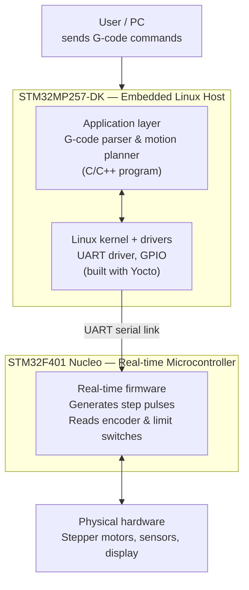

# OpenMotion — A Motion Controller Built on Embedded Linux
 
## What is this project?
 
This project is a motion controller for machines that move using stepper motors — for example, a small CNC machine or a 3D printer. It reads movement commands (called "G-code", the standard language for CNC/3D printer movements) and turns them into precise motor movements.
 
Most cheap CNC/3D printer controllers use a single small, weak chip to do everything: read commands, plan movements, AND control the motors at the exact right time. This makes them slow and limited.
 
This project splits the work between **two computers**, the same way many real industrial and robotics products do it:
 
- A **Linux computer** (the STM32MP257-DK) — has a lot of processing power. It reads the G-code file, figures out HOW the machine should move (speed, direction, timing of each step), and sends simple commands to the second computer.
- A **small, fast microcontroller** (the STM32F401 Nucleo) — does ONE job extremely well: it generates the exact electrical pulses that make the stepper motors move, at the exact right time, with no delay.
This split is important because Linux is great at complex logic but is not good at doing things at *exactly* the right microsecond (because it's busy doing many other things at once). A small microcontroller running no operating system (or a tiny real-time OS) CAN do that. So we let each computer do what it's best at.
 
This is the same idea used by **Klipper**, a popular open-source 3D printer firmware, where a Raspberry Pi does the planning and a small microcontroller does the step timing.
 
---
 
## Why does this matter? (the real-world problem)
 
If you've ever used a cheap 3D printer or CNC machine, you may have noticed:
- It can't move very fast without losing steps or vibrating badly
- It's hard to add new features (web control, cameras, advanced calculations) because the small chip doesn't have enough power
By moving the "thinking" part to Linux, we get:
- Enough power to plan smooth, fast movements
- The ability to add a web interface, logging, networking, and more
- A system that is closer to how real industrial motion controllers are designed
---
 
## How the system is organized (architecture)
 
The system has two main parts that talk to each other over a simple serial (UART) connection.
 

 
### What each layer actually does
 
**1. User / PC**
This is just you (or anyone using the machine). You send a G-code file — a text file with simple movement instructions like "move to position X=10, Y=5 at speed 50".
 
**2. Application layer (on the Linux side)**
This is a C/C++ program that:
- Reads the G-code file line by line
- Calculates HOW to move smoothly (acceleration, deceleration, speed limits) — this is called "motion planning"
- Translates each movement into simple step-by-step commands
- Sends these commands to the microcontroller over the serial connection
**3. Linux kernel + drivers (on the Linux side)**
This is the operating system layer that:
- Provides the serial port (UART) connection to talk to the microcontroller
- Provides access to GPIO pins (for things like a status LED or display)
- Is built and customized using **Yocto**, a tool for creating custom Linux systems for embedded devices
**4. UART serial link**
A simple wired connection between the two boards. The Linux side sends short messages like "move motor 1 by 200 steps at this speed", and the microcontroller side replies with status information.
 
**5. Real-time firmware (on the STM32F401 Nucleo)**
This is a small program (no full operating system, or a very small real-time OS) that:
- Receives movement commands from the Linux side
- Generates exact, precisely-timed electrical pulses to move the stepper motors
- Reads the rotary encoder (for manual control / jogging)
- Reads limit switches (so the machine knows when it has reached the end of its travel — used for "homing")
**6. Physical hardware**
The actual motors, sensors, and display connected to the microcontroller:
- Stepper motors (NEMA17) driven through A4988/DRV8825 driver modules
- Rotary encoder (for manual jog control)
- MPU6050 (accelerometer/gyroscope) — used later for vibration monitoring
- TFT display — shows status information
---
 
## Hardware used
 
| Component | Purpose |
|---|---|
| STM32MP257-DK | Runs embedded Linux, does motion planning |
| STM32F401RE Nucleo | Runs real-time firmware, controls motors precisely |
| NEMA17 stepper motor(s) | Moves the machine axis |
| A4988 / DRV8825 driver | Converts step/direction signals into motor current |
| Rotary encoder | Manual jog control |
| MPU6050 | Vibration sensing (used in a later stage) |
| Limit switch(es) | Homing / end-stop detection |
| 2.8" SPI TFT display | Local status screen |
| Lab power supply | Powers the motors safely |
 
---
 
## Software / tools used
 
- **Yocto Project** — to build a custom embedded Linux image for the STM32MP257-DK
- **C / C++** — for both the Linux application and the microcontroller firmware
- **STM32CubeIDE / STM32 HAL** — for the STM32F401 firmware
- A simple custom **serial protocol** between the two boards (documented in `docs/protocol.md`)
---
 
## Repository structure
 
```
openmotion/
├── README.md                  <- you are here
├── DEVELOPMENT_ROADMAP.md      <- step-by-step build plan and learning notes
├── firmware/                   <- STM32F401 real-time firmware (C)
├── host/                        <- Linux application (C/C++): G-code parser, motion planner
├── meta-openmotion/             <- custom Yocto layer for the STM32MP257-DK image
├── docs/
│   ├── protocol.md               <- serial communication protocol description
│   └── wiring.md                 <- wiring diagrams and pin connections
└── tools/                        <- helper scripts (flashing, testing, etc.)
```
 
---
 
## Project status
 
This project is being built step by step, in public, as part of a learning journey into embedded Linux development. See `DEVELOPMENT_ROADMAP.md` for the current progress and what's coming next.
 
- [ ] Phase 1 — Hardware setup and wiring
- [ ] Phase 2 — Serial communication protocol
- [ ] Phase 3 — Real-time firmware on STM32F401
- [ ] Phase 4 — Linux host application (G-code parser + motion planner)
- [ ] Phase 5 — Custom Yocto image for STM32MP257-DK
- [ ] Phase 6 — Integration and first real movement
- [ ] Phase 7 — Extra features: display, encoder jog control, homing
- [ ] Phase 8 — Vibration sensing with MPU6050
- [ ] Phase 9 — Web interface for sending G-code remotely
---
 
## How to build and run
 
*(This section will be filled in as each phase is completed — for now, see `DEVELOPMENT_ROADMAP.md` for the current build instructions for each part.)*
 
---
